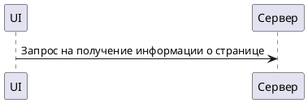
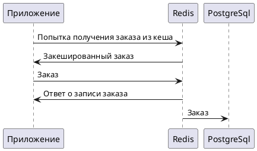
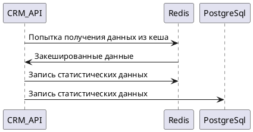
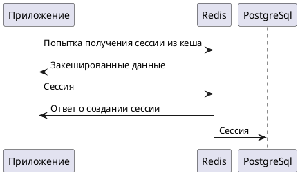
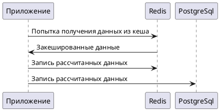
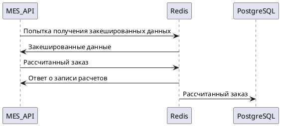

# Архитектурное решение по кешированию

## Части системы для кеширования

### CRM API

* Кешируем информацию о последних заказах пользователей
* Сессии пользователей
* Часто запрашиваемая информация
* Статистические данные (дашборды)

### MES API

* Кешируем последние расчеты для быстрого доступа и сокращения процесса расчета. Можем искать ближайшие значение и досчитывать только разницу.

### Shop API

* Кешируем последние заказы пользователей
* Сессии пользователей
* Часто посещаемые страницы
* Часто запрашиваемая информация

## Мотивация

Кеширование необходимо для уменьшения времени ответа, снижения нагрузки на базу данных и бэкенд.
Внедрение кеша поможет уменьшить нагрузку на сервисы и поможет менеджерам оперативнее получать интересующую их информацию, также это увеличит скорость расчета заказов и в некоторых случаях при падении некоторых сервисов поможет предоставлять пользователям закешированную информацию, что суммарно увеличит удовлетворенность клиентов и менеджеров проекта.

## Предлагаемое решение

Для частопосещаемых страниц можно предусмотреть клиентское кеширование это поможет оставить у пользователя рабочие страницы в случае падения одного или нескольких сервисов. Для остальных рекомендуется использовать серверное кеширование, например в Reddis.

[Диаграмма](./client_cache.puml)

Для кеширования заказов предлагается использовать паттерн Write-Through. При создании заказа мы будем записывать данные в кеш, а потом записывать в бд. Мы не можем использовать Write-Behind так как для нас критически важно подтвердить создание заказа. Также нам не подойдет вариант Refresh-ahead так как он обновляет кеши раз в какое-то время, что может вызывать задержки в обработке новых заказов и недовольство со стороны менеджмента.

[Диаграмма](./orders_cache.puml)

Для кеширования статистических данных предлагается использовать паттерн Cache-Aside. Cache-aside прост в реализации и может генерировать кеши по требованию (агрегаты) и хранить только тот кеш, который необходим пользователям. Это сократит обьем хранимой информации. Другие варианты будут более сложными для реализации и более дорогими в хранении.

[Диаграмма](./metriks_cache.puml)

Для кеширования сессий предлагается использовать паттер Write-Through. При создании новой сессии нам очень важно подтвердить что сессия создана поэтому используем его. С остальными паттернами повторяются проблемы описанные в кешировании заказов.

[Диаграмма](./session_cache.puml)

Для часто запрашиваемой информации предлагается использовать паттер Cache-Aside так как он идеально подойдет под этот кейс, он легок в реализации и устойчив к мисс-кешам.

[Диаграмма](./most_read_cache.puml)

Для кеширования последних расчетов отлично подойдет паттерн Write-Through. Он также помогает нам убедиться, что заказ и расчет клиента был записан.

[Диаграмма](./last_calc.puml)

### Стратегия инвалидации кеша

Для инвалидации кешей предлагается использовать комбинацию стратегий инвалидации по времени (TTL) и дополнительную стратегию для отдельных кешей.

Для частопосещаемых страниц предлагается рассмотреть стретении инвалидации по времени и стратегию инвалидации по запросам. Так как товары могут раскупить и необходимо будет обновить кеш страницы с актуальным статусом.

Для кеширования заказов подойдет инвалидация по времнеи и программная инвалидация. Так как информация о заказе может включать в себя множество сложной логики и разных подходов к инвалидации кеша. Например в заказе пользователь/менеджер может оставить комменатарий, измениться статус итд., что необходимо гибко контролировать и обновлять.

Для кеширования статистических данных подойдет инвалидация по времени плюс программная инвалидация. Так как метрики могут быть достаточно сложными и включать сложные агрегаты стратегиями инвалидации кешей также необходимо будет гибко управлять.

Для кеширования сессий будет необходимо использовать инвалидацию по времени и программную инвалидацию. Так как приложение само управляет авторизацией и выходом пользователя и может включать в себя сложные проверки.

Для часто запрашиваемой информации подойдет инвалидация по времени в комбинации с инвалидацией на основе изменений.

Для кеширования последних расчетов подойдет инвалидация по времени и программная инвалидация.

|Наименование|Основная стратегия|Дополнительная стратегия|Почему эта комбинация|Почему другие не подходят|
| --- | --- | --- | --- | --- |
|Частопосещаемые страницы|Инвалидация по времени (TTL: 5 мин)|Инвалидация по событиям (изменение цены/наличия)|✅ Баланс между актуальностью и производительностью   ✅ Автоматическое обновление при бизнес-событиях	|❌ Только TTL: риски устаревших данных при распродажах   ❌ Только по событиям: сложно отследить все изменения|
|Кеширование заказов|Инвалидация по времени (TTL: 1 час)|Программная инвалидация (изменение статуса/комментариев)|✅ Гарантия актуальности критичных данных   ✅ Гибкость для сложной бизнес-логики | ❌ Только TTL: задержки в обновлении статусов   ❌ Только программная: риски "вечного" кеша при ошибках |
|Статистические данные| Инвалидация по времени (TTL: 15 мин) | Программная инвалидация (по расписанию/запросу) | ✅ Баланс свежести и производительности   ✅ Контроль над сложными агрегациями | ❌ Только TTL: не учитывает бизнес-циклы   ❌ Только программная: избыточная нагрузка в пиковые периоды|
|Сессии пользователей | Инвалидация по времени (TTL: 24 часа) | Программная инвалидация (logout/timeout) | ✅ Безопасность и контроль доступа   ✅ Автоматическая очистка неактивных сессий | ❌ Только TTL: риски утечки сессий   ❌ Только программная: возможные "висящие" сессии | Часто запрашиваемая информация | Инвалидация по времени (TTL: 10 мин) | Инвалидация по изменениям (модификация исходных данных) | ✅ Оптимальное использование кеша   ✅ Актуальность при изменениях | ❌ Только TTL: возможны устаревшие данные   ❌ Только по изменениям: сложность отслеживания зависимостей | Последние расчеты | Инвалидация по времени (TTL: 30 мин) | Программная инвалидация (изменение исходных параметров)	✅ Баланс между перерасчетом и производительностью   ✅ Гарантия актуальности при изменении входных данных | ❌ Только TTL: избыточные перерасчеты   ❌ Только программная: сложность отслеживания всех зависимостей|
|||||
